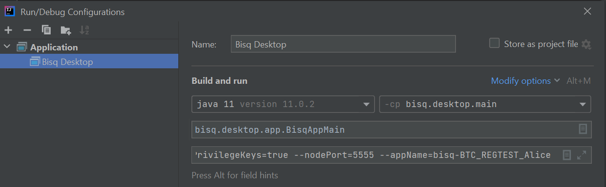

# Importing Haveno dev environment

This document describes how to import Haveno into an integrated development environment (IDE).

First [install and run a Haveno test network](installing.md), then use the following instructions to import Haveno into an IDE.

## Visual Studio Code (recommended)

1. Download and open Visual Studio Code: https://code.visualstudio.com/.
2. File > Add folder to Workspace...
3. Browse to the `haveno` git project.

## Eclipse IDE

> Note: Use default values unless specified otherwise.

1. If you haven't already, first [install and run a Haveno test network](installing.md).
2. Download and run the [Eclipse](https://www.eclipse.org/downloads/) installer.
3. Select "Eclipse IDE for Enterprise Java and Web Developers" to install.
4. Launch an eclipse workspace and close out of the welcome screen.
5. [Download](https://search.maven.org/search?q=g:org.projectlombok%20AND%20a:lombok&core=gav) the latest version of the lombok jar.
6. Run lombok jar, e.g.: `java -jar ~/Downloads/lombok-1.18.22.jar`.
7. Follow prompts to install lombok to your Eclipse installation.
8. Restart Eclipse.
9. File > Import... > Existing Gradle Project.
10. Select the location of "haveno" project, e.g. ~/git/haveno.
11. Advance to finish importing haveno project.
12. Right click haveno project > Gradle > Refresh Gradle Project.
13. File > Import... > Existing Projects into Workspace.
14. Select the location of "haveno-ts" project, e.g. ~/git/haveno-ts.
15. Advance to finish importing haveno-ts project.

You are now ready to make, run, and test changes to the Haveno project!

## IntelliJ IDEA

> Note: These instructions are outdated and for Haveno.

Most Haveno contributors use IDEA for development. The following instructions have been tested on IDEA 2021.1.

1. Follow the instructions in [build.md](build.md) to clone and build Haveno at the command line.
1. Open IDEA
1. Go to `File -> Settings -> Build, Execution, Deployment -> Compiler -> Annotation Processors` and check the `Enable annotation processing` option to enable processing of Lombok annotations (Lombok plugin installed by default since v2020.3)
1. Go to `File -> New -> Project from Existing Sources...` and then select the main Haveno folder to load automatically the related Gradle project
1. If you did not yet setup JDK11 in IntelliJ, go to `File-> Project Structure -> Project` and under the `Project SDK` option locate your JDK11 folder
1. Select JDK 11 for Gradle as well. Go to `File -> Settings -> Build, Execution, Deployment -> Build Tools -> Gradle` and select the JDK11 location for the Gradle JVM value
1. Go to `Build -> Build Project`. Everything should build cleanly
1. Go to `Run > Edit Configurations... -> Plus (+) icon on the top left -> Application` anf then fill the requested fields as shown below, while using as CLI arguments one of those listed in [dev-setup.md](dev-setup.md):

9. Now you should be able to run Haveno by clicking on the _Play_ button or via `Run -> Run 'Haveno Desktop'`
10. If you want to debug the application and execute breakpoints, use `Run -> Debug 'Haveno Desktop'`

> TIP: If you encounter compilation errors in IDEA related to the `protobuf.*` classes, it is probably because you didn't build Haveno at the command line as instructed above. You need to run the `generateProto` task in the `other` project. You can do this via the Gradle tool window in IDEA, or you can do it the command line with `./gradlew :other:generateProto`. Once you've done that, run `Build -> Build Project` again and you should have no errors.
>
> If this does not solve the issue, try to execute `./gradlew clean` and then rebuild the project again.